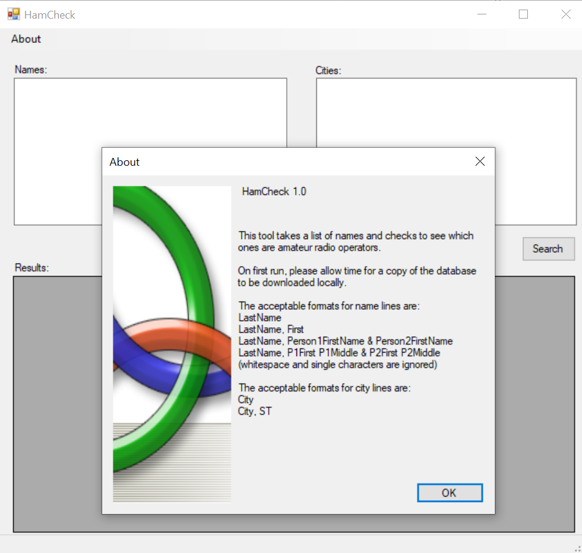

# hamcheck

This tool takes a list of names and checks to see which ones are amateur radio operators.

## Installation
The latest release can be downloaded from:  https://github.com/ad7f/hamcheck/releases/latest
Extract the .zip file, and then run hamcheck.exe

## Screenshot




## Notes

On first run, please allow time for a copy of the database to be downloaded locally. 

The tool was designed to make it possible to copy and paste a large list of names into the tool.

The currently accepted formats for name lines are:
```
LastName
LastName, First
LastName, Person1FirstName &amp; Person2FirstName
LastName, P1First P1Middle &amp; P2First P2Middle
```
Note: Whitespace and single character lines can be included in the list that is copy and pasted in, they will be ignored.

City lines are optional, but can help you scope to a particular area. When separated by a comma, two letter state abbreviations can also be used. This can be helpful in cases where many states have the same city name.

The currently accepted formats for city lines are:
```
City
City, ST
```

## Tips for building from source

When building this project from source using the zip file method, it will be required to remove the "Mark of the Web" from all downloaded files prior to building in Visual 2019.  For more information on how to do this, see  [How To Tips - Remove the Mark of the Web Visual Studio 2019 - ericnagel.com](https://www.ericnagel.com/how-to-tips/remove-the-mark-of-the-web-visual-studio-2019.html) 

Make sure the [Visual Studio NuGet Package manager](https://docs.microsoft.com/en-us/nuget/consume-packages/install-use-packages-visual-studio) has the [System.Data.SQLite.Core](https://www.nuget.org/packages/System.Data.SQLite.Core/) installed

